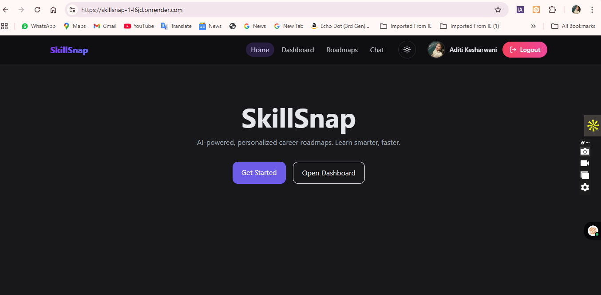
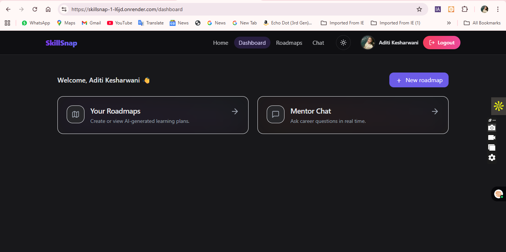
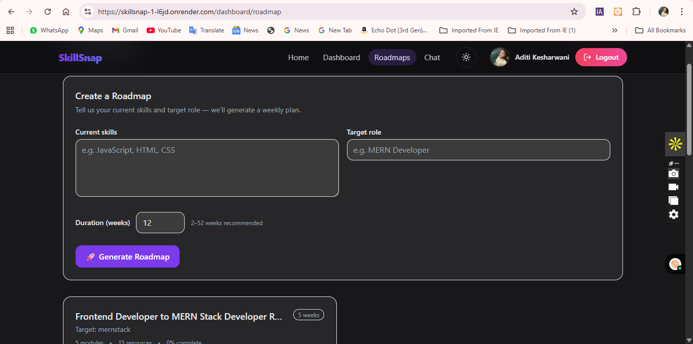
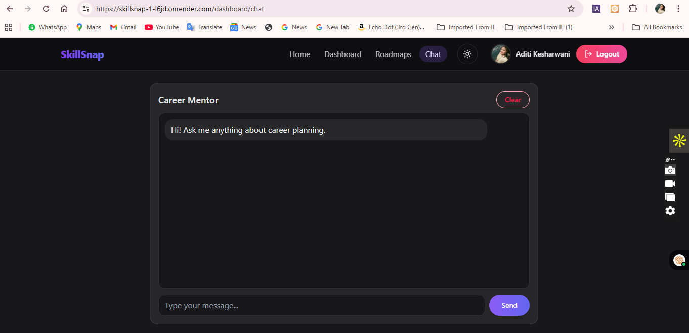

# 🌟 SkillSnap – AI-Powered Career Roadmap & Mentor Chat

  
  
  
  
  

> **Live Demo:** [https://skillsnap-1-l6jd.onrender.com](https://skillsnap-1-l6jd.onrender.com)

---

## 📖 Overview
**SkillSnap** is an **AI-powered learning & career roadmap generator** where users can:
- 📚 Create personalized **career roadmaps** (Frontend, Backend, etc.)
- 💬 Chat with an **AI Career Mentor**
- ✅ Track progress with modules & resources
- 🔑 Secure login via **Google OAuth**
- 🛠 Built with **Next.js App Router**, **Prisma ORM**, **Postgres**, and **TailwindCSS**

This project is a **portfolio showcase** to demonstrate full-stack development skills:  
Authentication • Database schema design • API integration • AI-powered workflows • UI/UX polish.

---

## 🚀 Features
- 🔐 **Authentication:** Google Sign-In with NextAuth
- 🗂 **Roadmap Builder:** Auto-generated modules & resources for career goals
- 📊 **Progress Tracking:** Mark modules as done
- 🤖 **AI Mentor Chat:** Ask questions, get career guidance
- 🎨 **Beautiful UI:** Responsive TailwindCSS design
- 🌍 **Deployed on Render:** with PostgreSQL cloud database

---

## 🛠️ Tech Stack
- **Frontend:** [Next.js 14 (App Router)](https://nextjs.org/)
- **UI Styling:** [TailwindCSS](https://tailwindcss.com/) + [Lucide Icons](https://lucide.dev/)
- **Backend:** [NextAuth.js](https://next-auth.js.org/) for Authentication
- **Database:** [PostgreSQL](https://www.postgresql.org/) via [Prisma ORM](https://www.prisma.io/)
- **AI API:** OpenRouter API (ChatGPT-style responses)
- **Hosting:** [Render](https://render.com/)

## 📸 Screenshots

### 🏠 Home Page  


### 📊 Dashboard  


### 🗺️ Roadmap Generator  


### 💬 Mentor Chat  



## 📂 Project Structure
SkillSnap/
├── prisma/ # Prisma schema & migrations
├── src/
│ ├── app/ # Next.js App Router pages
│ │ ├── (dashboard)/
│ │ └── api/auth/ # NextAuth routes
│ ├── components/ # Reusable UI components
│ ├── lib/ # Database & Auth config
│ └── styles/ # Tailwind config
├── package.json
├── README.md
└── .env (ignored)


## ⚙️ Setup (Local Development)

### 1️⃣ Clone repo
```bash
git clone https://github.com/Aditi2354/SkillSnap.git
cd SkillSnap


Install dependencies
npm install


Setup environment variables

Create .env file:

DATABASE_URL="postgresql://..."
DIRECT_URL="postgresql://..."
NEXTAUTH_URL=http://localhost:3000
NEXTAUTH_SECRET=your_secret_key
GOOGLE_ID=your_google_client_id
GOOGLE_SECRET=your_google_secret
AI_PROVIDER=openrouter
OPENROUTER_API_KEY=your_api_key

4️⃣ Run Prisma migrations
npx prisma generate
npx prisma migrate dev --name init
npx prisma db seed

5️⃣ Start development
npm run dev


App will run at 👉 http://localhost:3000

📸 Screenshots
Dashboard

AI Mentor Chat

👩‍💻 Author

Aditi Kesharwani
🔗 LinkedIn
 | GitHub

📜 License

This project is licensed under the MIT License.

✨ If you like this project, star the repo ⭐ and connect with me on GitHub!
---

## 📂 Project Structure
